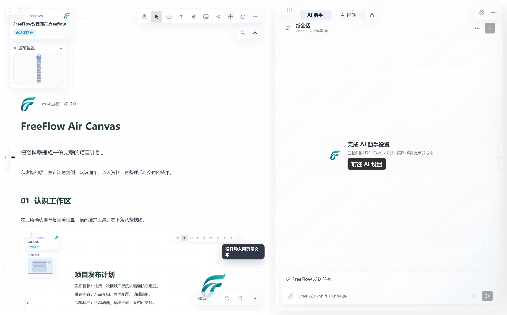
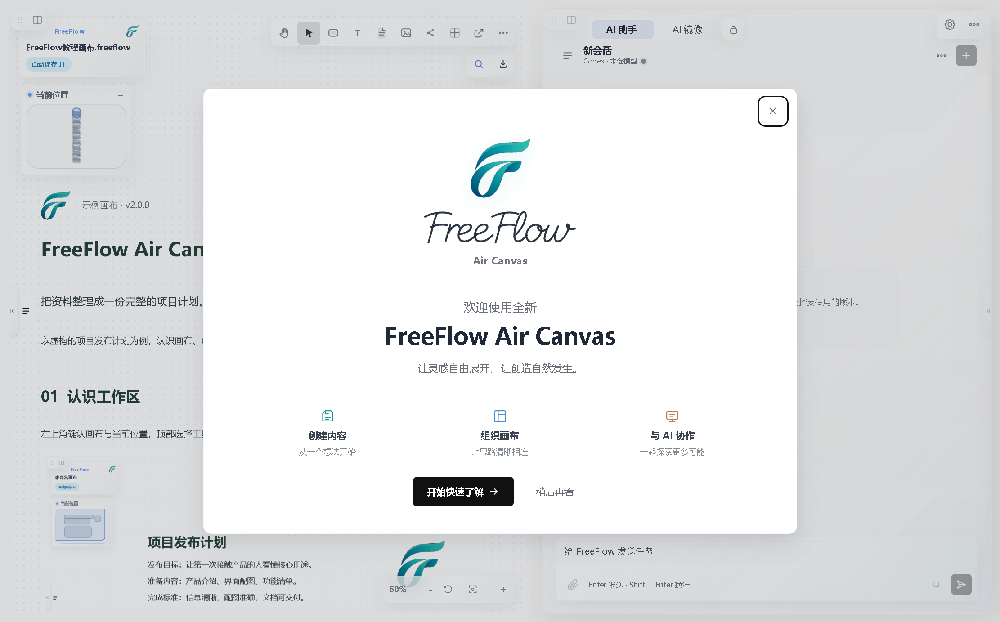
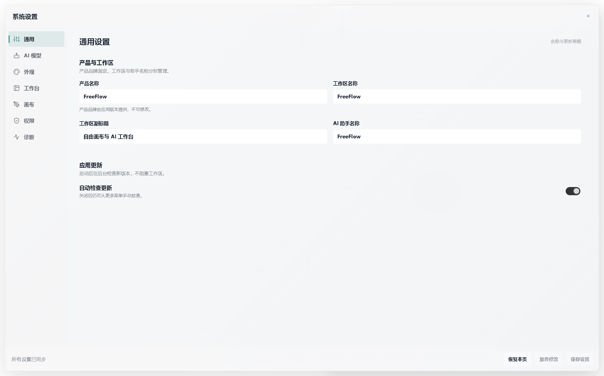
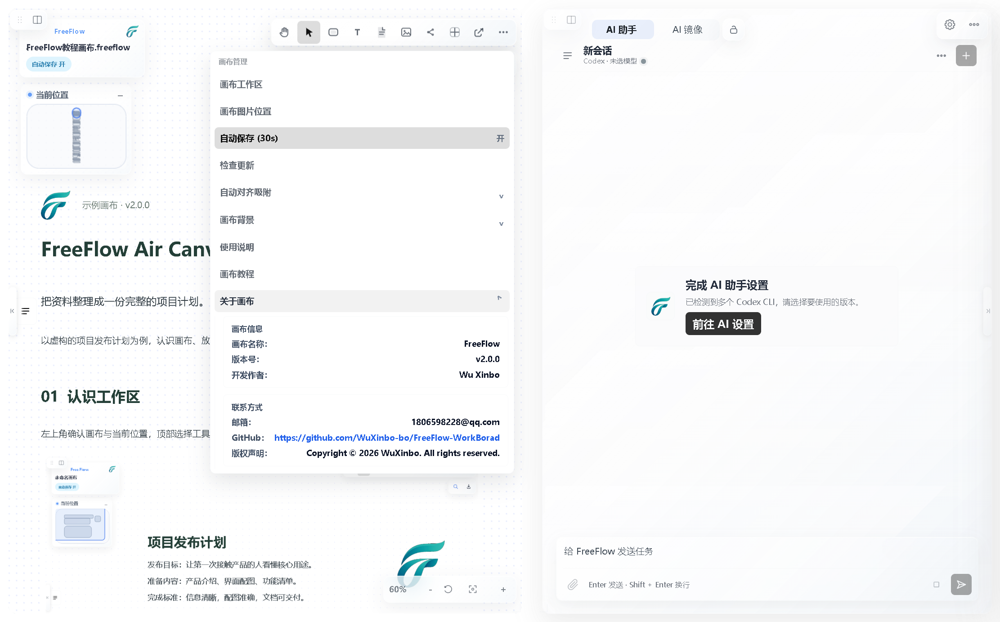

# FreeFlow

<p align="center">
  
</p>

<h3 align="center">本地桌面型结构化内容工作画布</h3>

<p align="center">
  把外部内容接入、画布结构化编辑、本地文件管理和办公文档输出连接成一条完整工作流。
</p>

<p align="center">
  
  
  
  
</p>

<p align="center">
  <a href="https://wuxinbo-bo.github.io/"><strong>Live Demo / 演示网站</strong></a>
  ·
  <a href="https://github.com/WuXinbo-bo/FreeFlow-WorkBorad/releases/tag/v2.0.0"><strong>Download / 安装包下载</strong></a>
</p>

## FreeFlow 是什么

FreeFlow 是一个以 Windows 本地桌面端为核心的知识工作画布，面向知识整理、资料归档、结构化编辑和正式交付。你可以在同一工作区整理素材、组织思路，并结合 AI 助手完成内容加工。

它的核心目标是打通这条主链路：

```text
外部内容接入 -> 画布结构化编辑 -> 本地工作区沉淀 -> 多格式办公输出
```

在 FreeFlow 中，文本、图片、文件、表格、代码、公式、链接和节点对象可以被放入同一张画布中组织，并参与搜索、复制、导出、保存和后续编辑。

## 界面展示



## 2.0 更新

- **新的工作区体验**：画布与 AI 工作区支持切换、拖动和调整尺寸，工具、搜索和导出入口集中在画布周围。
- **重做欢迎与教程**：新版欢迎界面、可编辑的示例画布和分步教程。模板更新会保留旧教程备份，并使用你配置的画布保存目录。
- **画布编辑与呈现改进**：文本、思维导图、导航和多种结构化元素的编辑、缩放与恢复行为经过回归检查。
- **主题与设置中心**：集中管理外观、工作区、模型连接、权限、快捷键与更新设置。
- **启动端口自动避让**：默认本机端口为 53127；端口被其他程序占用时自动选择空闲端口，桌面窗口和导出功能跟随实际地址。
- **面板拖动性能**：调整画布尺寸时暂停相邻工作区的模糊效果，结束后恢复，减少拖动期间的重复绘制。



## 可以做什么

| 工作内容 | FreeFlow 中的操作 |
| --- | --- |
| 整理资料 | 粘贴文字、Markdown 和图片，拖入本地文件，放入同一画布 |
| 组织思路 | 使用文本、连线、分组和思维导图表达关系 |
| 编辑结构化内容 | 编辑表格、代码块、公式和文档预览等元素 |
| 查找与管理 | 搜索画布内容，切换本地画布与目录，管理图片和附件 |
| AI 辅助 | 配置模型连接，在 AI 工作区中辅助整理和生成内容 |
| 交付成果 | 按内容类型导出 Word、Excel、Markdown、PNG、PDF 等格式 |

画布以 `.freeflow` 文件保存。导出可用格式取决于所选内容；AI 功能需要自行配置支持的模型服务或本地工具。





## 安装与升级

支持 Windows 10/11 x64。

1. 在 [Releases](https://github.com/WuXinbo-bo/FreeFlow-WorkBorad/releases/latest) 下载 `FreeFlow-v2.0.0-x64.exe`。
2. 运行安装程序。已有旧版时，关闭旧版后覆盖安装到原目录。
3. 启动 FreeFlow，选择画布目录，并按需配置 AI 连接。

免安装体验可使用 `FreeFlow-v2.0.0-x64-portable.exe`。免安装版仍会在本机保存设置和业务数据。

默认业务数据位于 `%USERPROFILE%\FreeFlow`，自定义画布目录按设置使用。升级和卸载不会主动删除业务数据；重要画布建议单独备份。发布页同时提供 `SHA256SUMS.txt`，可用于核对下载文件。

### 检查更新

应用内“检查更新”从本仓库的 GitHub Releases 获取最新正式版本，比较当前版本后提供安装包下载入口。升级通过运行新版安装包完成。

发布标签采用 `v2.0.0` 形式，安装包必须保持 `FreeFlow-v<版本>-x64.exe` 命名。便携版不能替代这个安装包文件。网络不可用或 GitHub 接口限流时可以稍后重试。

## 从源码运行

建议使用 Node.js 24 LTS 与 npm。Windows 桌面能力以 Electron 运行结果为准。

```powershell
git clone https://github.com/WuXinbo-bo/FreeFlow-WorkBorad.git
cd FreeFlow-WorkBorad
npm ci
npm run prepare:desktop-build
npm run start:desktop
```

仅启动网页开发服务：

```powershell
npm start
```

默认地址为 `http://127.0.0.1:53127`。若端口被占用，请使用终端打印的实际地址。网页模式不具备全部桌面文件与窗口能力。

需要指定端口时，设置 `FREEFLOW_PORT`；设置为 `0` 可始终由系统分配。桌面端不再继承其他开发项目设置的通用 `PORT` 环境变量。

```powershell
$env:FREEFLOW_PORT = "53128"
npm run start:desktop
```

模型服务配置可参考 `.env.example` 或应用设置中心。不要将真实令牌、账号配置和个人业务数据提交到仓库。

## 测试与打包

```powershell
npm ci
npx playwright install chromium
npm run prepare:desktop-build
npm test
npm run check:release-version
npm run check:desktop-upgrade
npm run check:desktop-packaging
npm run dist:win
```

`npm test` 包含后端、桌面通信、画布编辑、启动恢复、设置、教程及浏览器交互检查。正式打包会重新生成资源并执行版本、打包与升级检查，产物位于 `release/`。

发布流程和产物命名见 [打包说明](build/README.md)。2.0 发布前的远程 `main` 保存在 [备份分支](https://github.com/WuXinbo-bo/FreeFlow-WorkBorad/tree/backup/main-before-v2.0.0-20260905)。

## 反馈与许可

提交 Issue 时请提供软件版本、复现步骤和必要截图，并移除个人文件、账号和密钥信息。

本项目允许非商业使用；商业使用需要作者授权。具体范围以 [LICENSE.md](LICENSE.md) 为准。

作者：Wu Xinbo · 联系邮箱：180695828@qq.com
