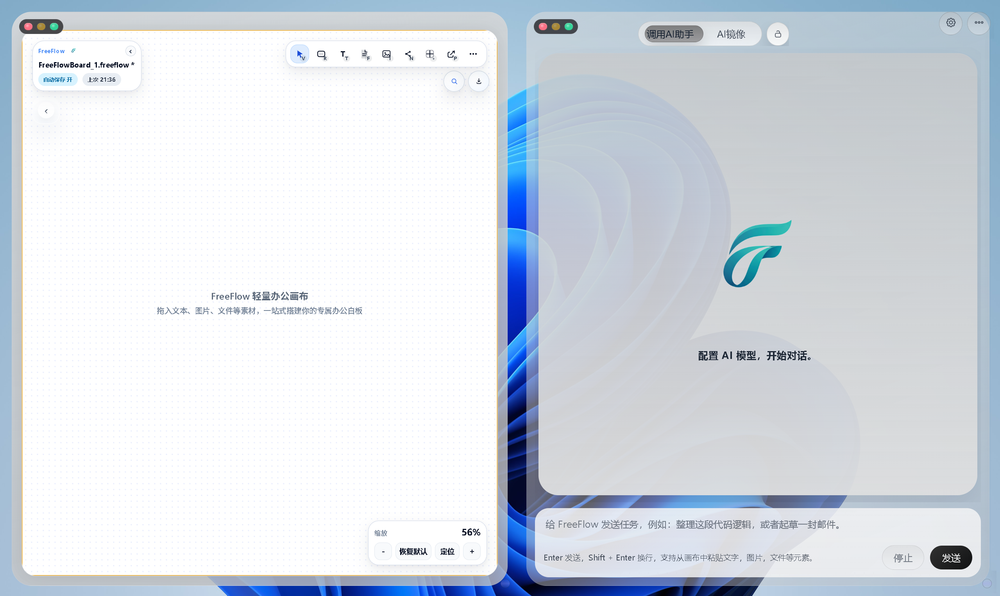
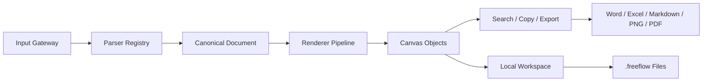

# FreeFlow

<p align="center">
  
</p>

<h3 align="center">本地桌面型结构化内容工作画布</h3>

<p align="center">
  把外部内容接入、画布结构化编辑、本地文件管理和办公文档输出连接成一条完整工作流。
</p>

<p align="center">
  
  
  
  
</p>

<p align="center">
  <a href="https://wuxinbo-bo.github.io/"><strong>Live Demo / 演示网站</strong></a>
  ·
  <a href="https://github.com/WuXinbo-bo/FreeFlow-WorkBorad/releases"><strong>Download / 安装包下载</strong></a>
</p>

## FreeFlow 是什么

FreeFlow 是一个以本地桌面端为核心的知识工作画布。它不是单纯的白板，也不是只用于截图和摆放素材的视觉容器，而是面向知识整理、资料归档、结构化编辑和正式交付的内容工作台。

它的核心目标是打通这条主链路：

```text
外部内容接入 -> 画布结构化编辑 -> 本地工作区沉淀 -> 多格式办公输出
```

在 FreeFlow 中，文本、图片、文件、表格、代码、公式、链接和节点对象可以被放入同一张画布中组织；这些对象不只是可见元素，还可以参与搜索、复制、导出、保存和后续回流。

## 界面展示

<p align="center">
  
</p>

## 为什么是 FreeFlow

很多知识工作并不是从空白文档开始的，而是从网页、截图、Markdown、表格、代码片段、文件资料和临时想法开始。传统工具常见的问题是：

- 白板适合发散，但导出后很难继续编辑。
- 文档适合交付，但不适合承接碎片化素材。
- 网页、文件和截图容易散落在不同目录和应用中。
- 从画布整理到 Word、PDF、Markdown、Excel 往往需要大量手工重排版。

FreeFlow 的设计重点不是“再做一个无限画布”，而是让画布成为结构化内容进入、组织、沉淀和交付的中间工作台。

## 核心特性

### Structured Content Intake：结构化内容接入

FreeFlow 使用统一输入链路处理粘贴、拖放、文件导入和内部复制。外部内容进入系统后，会先转换为可诊断的输入描述，再进入解析和渲染流程。

支持的内容方向包括：

- 文本、富文本和 HTML 片段
- Markdown 内容
- 图片和本地文件
- 代码块、表格、公式
- 内部画布对象复制与回流

### Native Canvas Objects：原生画布对象

画布对象不是简单贴图。FreeFlow 为多类元素提供统一运行时能力：

- 对象身份和几何边界
- 拖拽、缩放、选中和组合操作
- 对象级搜索字段抽取
- 结构化复制与外部兼容复制
- 导出前预处理和格式降级

### Local-First Workspace：本地优先工作区

FreeFlow 强调本地文件边界。画布、资源、最近记录和工作区设置都围绕本机目录组织，适合长期资料整理和个人知识资产沉淀。

核心本地能力包括：

- `.freeflow` 画布文件
- 本地工作区目录
- 图片与附件资源管理
- 最近画布恢复
- 启动状态迁移与兼容

### Office-Ready Export：面向办公交付的导出

FreeFlow 的输出目标不是简单截图，而是让画布内容尽可能进入后续办公流程。

当前核心输出方向包括：

- Word / DOCX
- Excel / XLSX
- Markdown
- CSV / Text
- PNG / PDF
- `.freeflow` 本地画布文件

### Large Canvas Runtime：大画布运行时能力

FreeFlow 内置面向大画布的运行机制，用于降低复杂画布下的交互和渲染成本。

相关机制包括：

- Scene Index 场景索引
- Render Scheduler 渲染调度
- Dirty Region 局部失效
- Tile Cache 瓦片缓存
- LOD 与编辑态覆盖层虚拟化

### Desktop Shell And AI Workspace：桌面壳层与 AI 工作区

项目基于 Electron 构建桌面壳层，提供本地文件访问、窗口控制、系统桥接和外部 AI 工作区嵌入能力。AI 能力不是替代画布，而是作为内容整理和思路生成过程中的辅助工作区。

## 系统架构



核心分层：

| 层级 | 职责 |
| --- | --- |
| Electron Shell | 桌面窗口、本地文件访问、系统桥接、AI 工作区集成 |
| Backend Services | 工作区、持久化、设置、会话、模型配置 |
| Canvas Host | 画布状态、命令入口、历史记录、选择态、对象生命周期 |
| Structured Content Pipeline | 输入描述、解析器注册、规范化文档、渲染管线 |
| Canvas Engine | 原生对象、场景索引、命中测试、渲染调度、瓦片缓存 |
| Output Layer | 结构化导出、办公格式输出、图片/PDF 导出、`.freeflow` 文件 |

## 适用场景与产品定位

FreeFlow 主要面向以下场景：

- 产品经理整理需求、流程、竞品资料和交付文档。
- 研究者整理论文、网页摘录、图表、公式和笔记。
- 教师组织课件素材、讲义内容和可视化知识结构。
- 开发者整理代码片段、接口说明、架构草图和技术文档。
- 个人用户沉淀长期知识库、资料夹和创作过程。

## 在线演示与下载

- 演示网站：<https://wuxinbo-bo.github.io/>
- Windows 安装包：请前往 [GitHub Releases](https://github.com/WuXinbo-bo/FreeFlow-WorkBorad/releases) 下载已打包版本。

如果你只是想体验产品，建议优先下载 Releases 中的安装包或便携版；如果你需要二次开发，再按下面的快速开始从源码启动。

## 快速开始

### 环境要求

- Windows 10 / Windows 11
- Node.js 20 或更高版本
- npm

### 安装依赖

```powershell
npm install
```

### 启动桌面版

```powershell
npm run start:desktop
```

### 启动 Web 调试服务

```powershell
npm start
```

桌面版是主要运行形态。Web 服务主要用于本地开发和调试，不作为正式使用入口。

## 构建与打包

构建 Canvas2D UI 资源：

```powershell
npm run build:canvas2d-ui
```

准备桌面打包资源：

```powershell
npm run prepare:desktop-build
```

构建 Windows 安装包：

```powershell
npm run dist:win
```

## 常用命令

| 命令 | 说明 |
| --- | --- |
| `npm start` | 启动本地后端 / Web 服务 |
| `npm run start:desktop` | 启动 Electron 桌面版 |
| `npm run build:canvas2d-ui` | 构建主画布 UI 资源 |
| `npm run build:canvas-office` | 构建办公导出相关前端资源 |
| `npm run check:canvas2d-regression` | 运行 Canvas2D 回归检查 |
| `npm run check:desktop-packaging` | 检查桌面打包前置条件 |
| `npm run dist:win` | 生成 Windows 安装版和便携版 |

## 项目结构

```text
core/
  electron/                 Electron 主进程、preload、系统桥接
  src/backend/              后端服务、持久化、工作区逻辑
  public/                   应用壳层、Canvas2D runtime、静态资源、前端代码
  public/src/engines/       画布引擎与结构化内容管线
  scripts/                  构建、打包、验证与辅助脚本
  build/                    桌面打包资源与预置文件
  data/                     公开教程画布预置资源
  server.js                 本地服务入口
  package.json              依赖与 npm 脚本
```


## 许可说明

FreeFlow 当前以非商业用途可见源码许可方式发布。

你可以将本项目用于个人学习、研究、教育和非营利项目，也可以在非商业前提下复制、修改和分发。任何商业使用都必须事先获得书面授权。

详细条款见 [LICENSE.md](./LICENSE.md)。

## 联系方式

项目联系：

- 1806598228@qq.com


## 说明与致谢

感谢参与 FreeFlow 内测与试用反馈的同学和朋友。正是这些真实使用过程中的问题反馈、体验建议和稳定性观察，帮助项目持续修正交互细节、完善本地工作流，并推动版本迭代走向更可用的正式形态。
